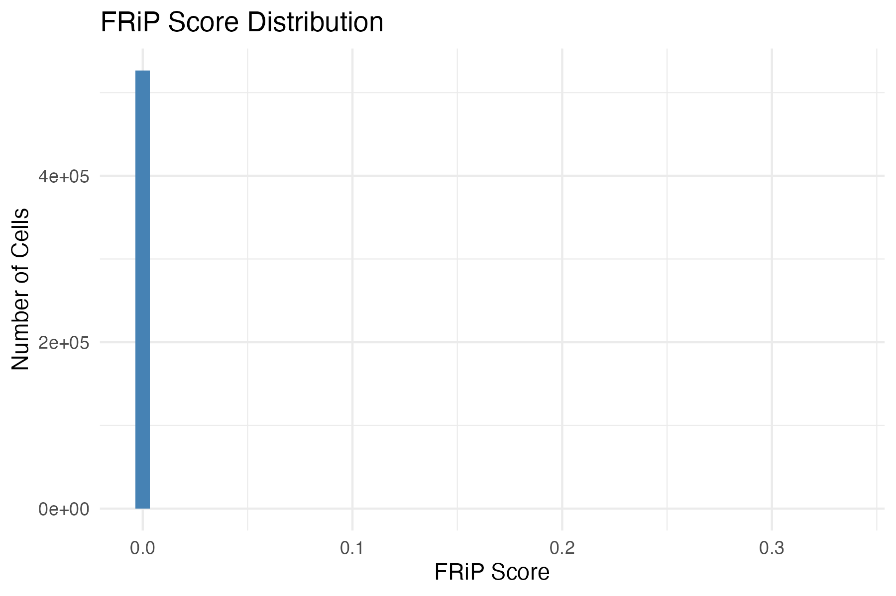
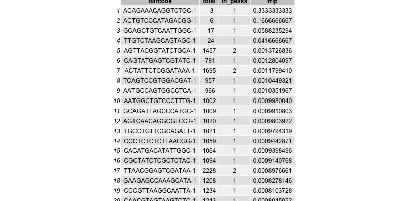
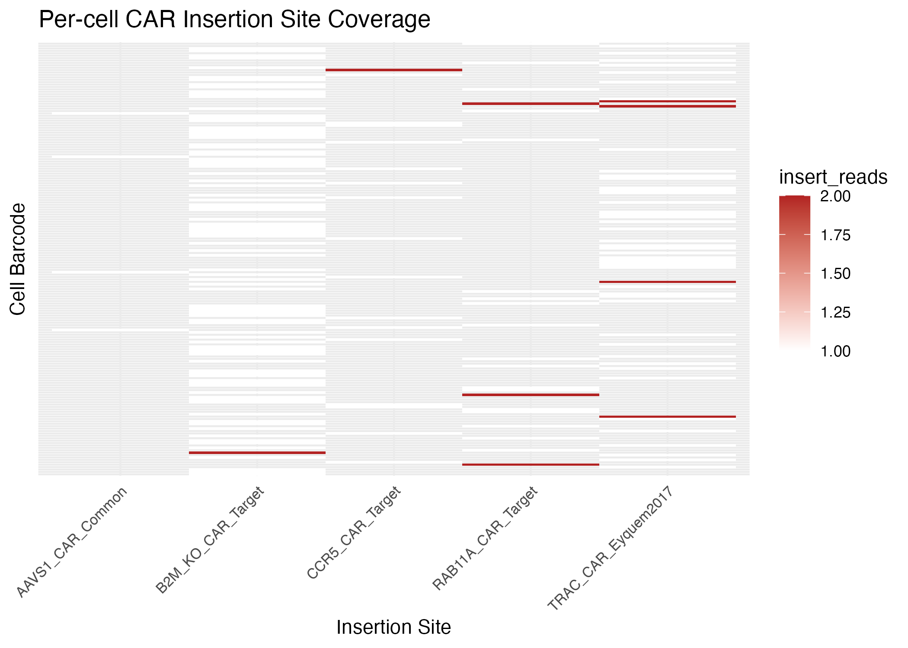
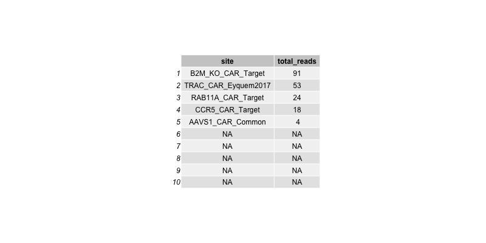

# CARTEpigenoQC

**CARTEpigenoQC** is an R package for quality control (QC) of CAR-T single-cell epigenomic data, including scATAC-seq, scCUT&Tag, and scBS-seq. It computes per-cell quality metrics like FRiP (Fraction of Reads in Peaks), detects coverage at CAR vector insertion sites (e.g. TRAC, EF1α, PGK1), and produces both HTML reports and static publication-ready figures.

---

## 📄 Project Links
- 📂 [Source Code](https://github.com/biosciences/CARTEpigenoQC): Explore the full repository
- 🔗 [Live Report](https://biosciences.github.io/CARTEpigenoQC/index.html): View the HTML output

## 🚀 Features

- Supports fragment files from 10x Genomics (`fragments.tsv.gz`) and ArchR format
- Computes FRiP score per cell
- Generates heatmaps of CAR vector site coverage
- Markdown/HTML QC reporting for clinical and preclinical pipelines
- Works with both 10x and non-10x scATAC/CUT&Tag data

---

## 📦 Installation

Install the development version from GitHub:

```r
# install.packages("devtools")
devtools::install_github("yourusername/CARTEpigenoQC")
```

---

## 🧪 Quick Start

```r
library(CARTEpigenoQC)
library(GenomicRanges)

# Example fragment and peak regions
frags <- GRanges(seqnames = "chr1", ranges = IRanges::IRanges(start = 100, end = 200), barcode = "cell_1")
peaks <- GRanges(seqnames = "chr1", ranges = IRanges::IRanges(start = 150, end = 180))

# Calculate FRiP score
frip_df <- calc_frip(fragments = frags, peaks = peaks)
print(frip_df)
```

---

## 📊 Example Output

Example figures generated from PBMC 10k data:

| Plot | Description |
|------|-------------|
|  | Distribution of FRiP scores across cells |
|  | Top 20 cells by FRiP |
|  | Heatmap of CAR vector insertion site coverage |
|  | Top 10 insertion sites by read count |

---

## 📂 Project Structure

```
CARTEpigenoQC/
├── R/                    # R source code
├── man/                  # Documentation (.Rd)
├── tests/                # testthat unit tests
├── inst/extdata/         # Example fragment and CAR BED files
├── scripts/run_qc.R      # Example usage script
├── vignettes/ (optional) # For longer tutorials
```

---

## 📜 Citation

If you use this package in your work, please cite:

> Lai, K. (2025). *CARTEpigenoQC: A quality control toolkit for CAR-T single-cell epigenomic data*. arXiv: https://arxiv.org/abs/2507.23048 (submitted to *Journal of Open Source Software*). https://github.com/biosciences/CARTEpigenoQC

📄 [Paper DOI link will be available soon.]

---

## ⚖️ License

MIT © 2025 Kaitao Lai. See [LICENSE](LICENSE) for details.
